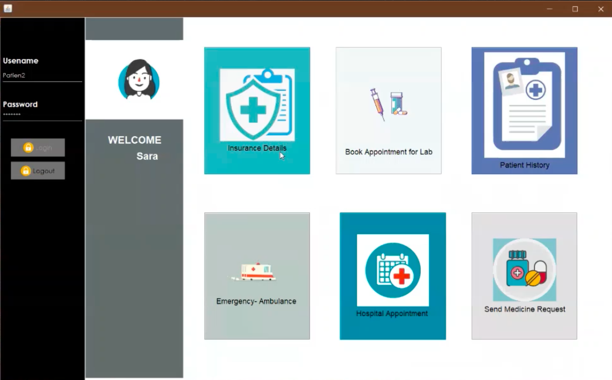

One stop application for healthcare personnel accessing the healthcare facilities.
This application provides community health condition analysis and help in proactive detection of any
epidemic situation.
Implemented live location sharing from maps, generation of entire patient history report, Email and SMS
notification features using advanced JAVA concepts.
Provides Scalable services with responsive interfaces.

You can list [links](https://drive.google.com/drive/u/0/folders/1HaFi-5kf8L1hE26JfcVCC6VcXP7e62Ch)
or even embed images with the following Markdown:

